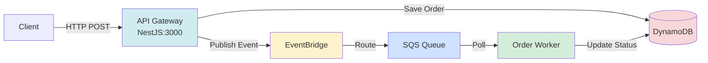

# 任务 1.2：架构理解
回答以下问题（可以写在单独的 markdown 文件中）：

1. 画出系统架构图，标注各组件之间的通信方式
2. 解释 LocalStack 在本地开发中的作用
3. 描述从 API 调用到 Worker 处理的完整消息流
4. `scripts/local-all.sh` 脚本做了哪些事情？
5. 如果 Worker 处理消息失败，消息会怎样？

---

## 1. 系统架构图



### 通信方式说明：

| 步骤 | 通信方式 | 说明 |
|------|---------|------|
| Client → API | HTTP REST | POST /api/orders (端口 3000) |
| API → DynamoDB | AWS SDK v3 | PutItem 保存订单 (PENDING 状态) |
| API → EventBridge | AWS SDK v3 | PutEvents 发布 OrderCreated 事件 |
| EventBridge → SQS | 事件规则路由 | 匹配 OrderCreated 事件自动转发 |
| SQS → Worker | AWS SDK v3 | 长轮询 (20秒) 接收消息 |
| Worker → DynamoDB | AWS SDK v3 | UpdateItem 更新状态 (COMPLETED) |


---

## 2. LocalStack 在本地开发中的作用

LocalStack 是一个本地 AWS 云服务模拟器,可以在本地模拟 EventBridge、SQS、DynamoDB，不需要真实AWS账号，不需要操作AWS创建各个服务，可以进行快速便捷的AWS平台开发

---

## 3. 从 API 调用到 Worker 处理的完整消息流

### 完整流程

1. **客户端发起请求**
   ```bash
   POST /api/orders
   ```

2. **API Gateway 处理**
   - `OrdersController` 接收请求
   - `OrdersService.createOrder()` 创建订单
   - 保存到 DynamoDB (状态: `PENDING`)
   - 发布 `OrderCreated` 事件到 EventBridge

3. **EventBridge 路由**
   - 匹配事件规则: `source: "orders.service"`, `detail-type: "OrderCreated"`
   - 自动转发到 SQS 队列 `local-order-processing-queue`

4. **Order Worker 处理**
   - `SQSPoller` 长轮询 (20秒) 接收消息
   - `OrderProcessor.process()` 处理订单
   - 更新 DynamoDB 订单状态: `PENDING` → `PROCESSING` → `COMPLETED`
   - 删除 SQS 消息

---

## 4. `scripts/local-all.sh` 脚本做了哪些事情？

1. **检查依赖** - 验证 Docker、AWS CLI、Node.js 是否已安装
2. **清理旧进程** - 终止之前运行的 API Gateway 和 Order Worker 进程
3. **清理日志** - 删除旧的日志文件 (`logs/api-gateway.log`, `logs/order-worker.log`)
4. **启动 LocalStack** - 运行 `docker compose up -d`，等待健康检查通过
5. **初始化 AWS 资源** - 调用 `localstack-setup.sh` 创建 EventBridge、SQS、DynamoDB 等资源
6. **启动服务** - 并行启动 API Gateway (端口 3000) 和 Order Worker，输出日志


---

## 5. 如果 Worker 处理消息失败，消息会怎样？

如果 Worker 处理消息失败，消息**不会被删除**，会自动重试：

1. **失败时** - Worker 捕获异常但不删除消息（只有成功时才调用 `DeleteMessageCommand`）
2. **可见性超时** - 消息在 30 秒后重新变为可见（`VisibilityTimeout: 30`）
3. **自动重试** - Worker 下次轮询时会再次接收到该消息
4. **最终处理** - 如果多次失败，消息会根据 SQS 队列配置进入死信队列（DLQ）或被丢弃
